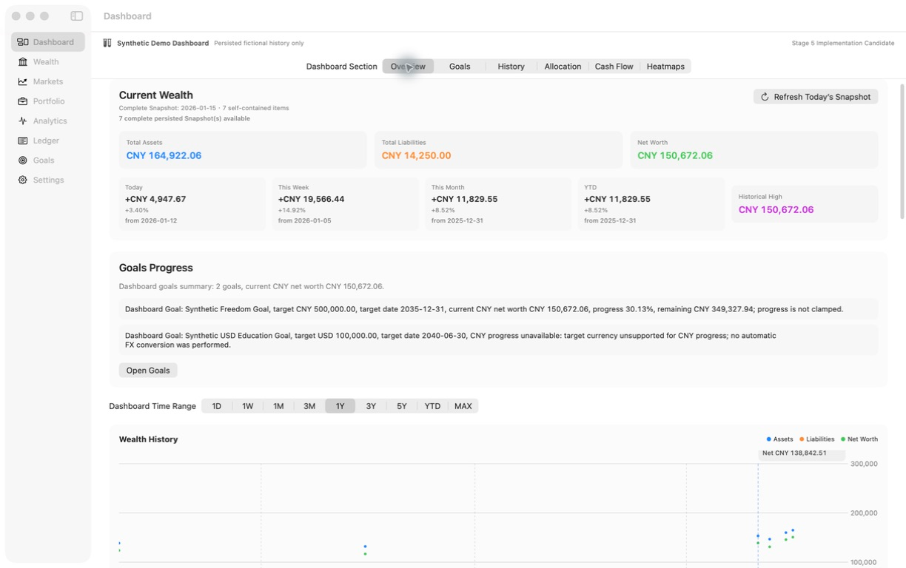
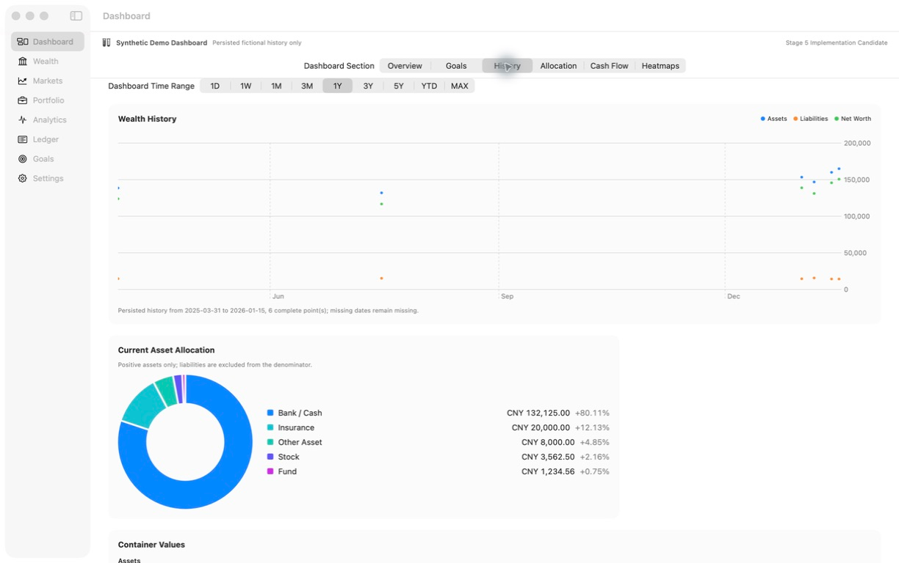
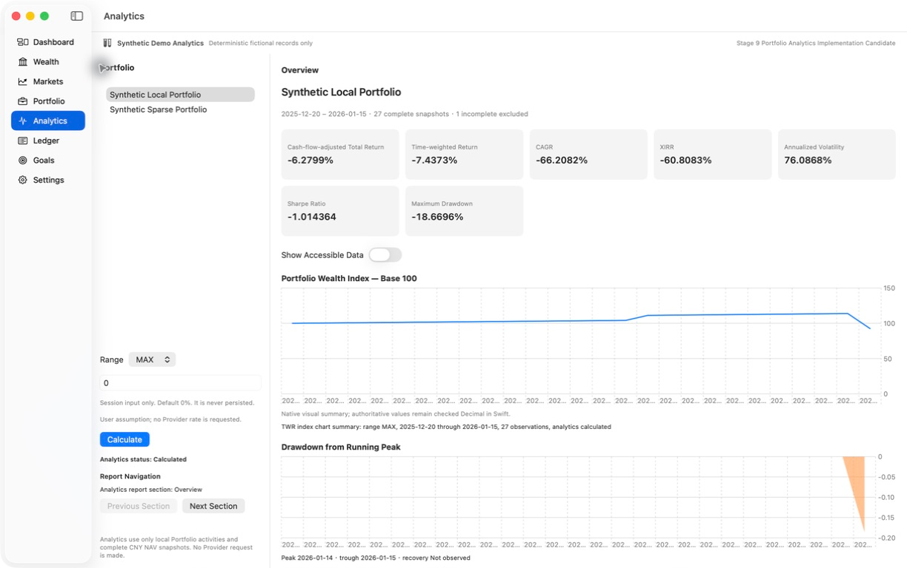

  

<h1 align="center">Aureus</h1>

Local-first personal wealth, portfolio analytics, and market terminal for macOS.

Keep wealth, portfolios, transactions, and goals together on your Mac.

  <a href="https://github.com/freeforest/Aureus/releases/tag/v1.0.0">Download</a> ·
  <a href="#screenshots">Screenshots</a> ·
  <a href="docs/README.md">Documentation</a> ·
  <a href="#build-from-source">Build from Source</a>

macOS 14+ · Apple Silicon · SwiftUI · Local-first · MIT

> The current 1.0.0 binary is ad-hoc signed, without Developer ID or Apple notarization. Read the [distribution notes and installation limits](docs/distribution.md) before installing.

*Aureus 1.0.0, Synthetic Demo. Fictional records, not real accounts or live Provider data.*

## Why Aureus

Aureus is a single-user personal wealth terminal built around financial context: what you own, how it is valued, how money moves, and how your portfolio changes over time.

- **Keep the broader picture.** Organize local accounts, assets, liabilities, and holdings alongside transactions and goals.
- **Retain currency context.** Use CNY for unified valuation while keeping a USD amount, its applied exchange rate, and its converted CNY value together.
- **Understand performance.** Explore portfolio returns, risk, and drawdown with calculations in Swift and visual summaries.
- **Separate records from market data.** Permanent wealth records have a different lifecycle from recoverable cache and transient Provider data.

## Core experience

### What do I own, and what changed?

Maintain wealth records and review the transactions behind them. The Ledger supports income, expenses, transfers, and investment events such as buys, sells, dividends, interest, and fees. Categories and tags help organize those records without an AI classifier.

### How is my portfolio doing?

Portfolio and Analytics connect holdings and recorded activity with performance analysis. Explicit calculation uses local portfolio observations; opening Analytics does not automatically request Provider data. Results depend on the available valuations and cash-flow history.

### What am I working toward?

Create and update financial goals, review progress, and explore contribution and return assumptions. Planning scenarios are not forecasts, investment recommendations, or guarantees.

These descriptions reflect the implementation scope. They do not claim comprehensive validation of every workflow or of the final binary on every supported Mac.

## Screenshots

These are real windows from the formal 1.0.0 App running an isolated Synthetic Demo. Historical Stage / Candidate labels remain visible in the App; they do not identify a different distribution. Click an image to inspect it at full size.

### Wealth history and allocation

Recorded assets, liabilities, and net worth alongside a breakdown of synthetic assets. Missing historical dates remain missing.

### Calculated portfolio analytics

The Analytics view shows the Synthetic Local Portfolio after calculation, including unavailable-history exclusions and the actual synthetic returns. These figures are not investment results or forecasts.

Markets and Ledger / Goals screenshots are not yet included. The current gallery demonstrates only the views shown above, not comprehensive UI validation.

## Privacy & data

Wealth records are stored locally. Aureus has no cloud account system, automatic brokerage synchronization, or AI/LLM capability.

Permanent records and Market Cache are isolated. Cache capacity, expiry, and cleanup must not delete permanent wealth records. Twelve Data Production data is **session-only in V1**; persistent Provider writes are disabled. Live access still depends on your own key, plan, endpoint permissions, and exchange rights.

Production credentials are entered through native Settings and stored in the application-scoped Keychain. Backups are not independently encrypted by Aureus: keep important records in independent, private backups.

Read [Privacy & Data](docs/privacy-and-data.md) for the boundaries, including safe issue reporting. Local-first is not a promise of zero network access or a guarantee that all historical repository content has been audited.

## Portfolio analytics

Implemented metrics include time-weighted return (TWR), XIRR, CAGR, annualized volatility, Sharpe ratio, and maximum drawdown. Performance and drawdown charts are paired with supporting data and calculation context.

Insufficient observations or invalid calculation inputs can produce explicit unavailable results. A displayed metric is a calculation from its inputs, not a promise of future returns.

## Markets

The market terminal includes symbol search, daily price charts, volume, moving averages, RSI, and MACD. Market details expose freshness and unavailable states. The 1D range means the latest daily bar, not intraday trading.

Provider access is entitlement-dependent; a search result does not establish permission to fetch prices. Aureus does not promise free real-time coverage of every market. See the [data policy](docs/privacy-and-data.md#market-data-and-credentials).

## Installation

Download the official [Aureus 1.0.0 release](https://github.com/freeforest/Aureus/releases/tag/v1.0.0), verify the published checksums, then follow the [installation instructions](docs/distribution.md).

Official binaries target Apple Silicon Macs with macOS 14 or later. This deployment target is not an all-device test claim. Ordinary use needs no QA launch arguments. Stop if macOS reports malware, damage, or suspected tampering; do not disable system security controls to install.

## Build from source

Use the clean source ZIP attached to the release and the [public build guide](PUBLIC_README.md#build-from-source). It documents the Xcode / Swift baseline, pinned dependencies, and packaging workflow.

The release source archive uses that public guide as its root README. This repository presentation page is separate; it does not replace the packaging input or alter the already-published archive.

## Architecture

Aureus uses feature-first SwiftUI and Observation, explicit dependencies, Swift financial calculations, and GRDB over SQLite. Authoritative money uses checked fixed-point values and Decimal intermediates. Native charts and locally bundled Lightweight Charts provide the visual layer.

The [architecture reference](docs/V1_ARCHITECTURE.md) explains the decisions and tradeoffs. Some historical stage wording remains in the App and engineering documents.

## Known limitations & verification

Version 1.0.0 is a formal **user-exception release**. Overall technical evidence remains **PARTIAL**. Remaining manual, performance, log-privacy, and final-App runtime verification was accepted as unfinished; repository-history safety remains **NOT VERIFIED**.

Publication and anonymous download checks succeeded, but they are not runtime acceptance. Read the [1.0.0 verification summary](docs/evidence/release-1.0.0.md) for the distinction and the [verification index](docs/evidence/README.md) for historical context.

## Documentation

Start with the [documentation index](docs/README.md) for user guidance, building, architecture, and separately labeled historical engineering references.

## License

Aureus-owned source is [MIT licensed](LICENSE). Third-party components retain their [own licenses and notices](THIRD_PARTY_NOTICES.md). MIT does not grant rights to Provider data or credentials. Official platform support and the Provider's personal-use restrictions are separate from the source license.
