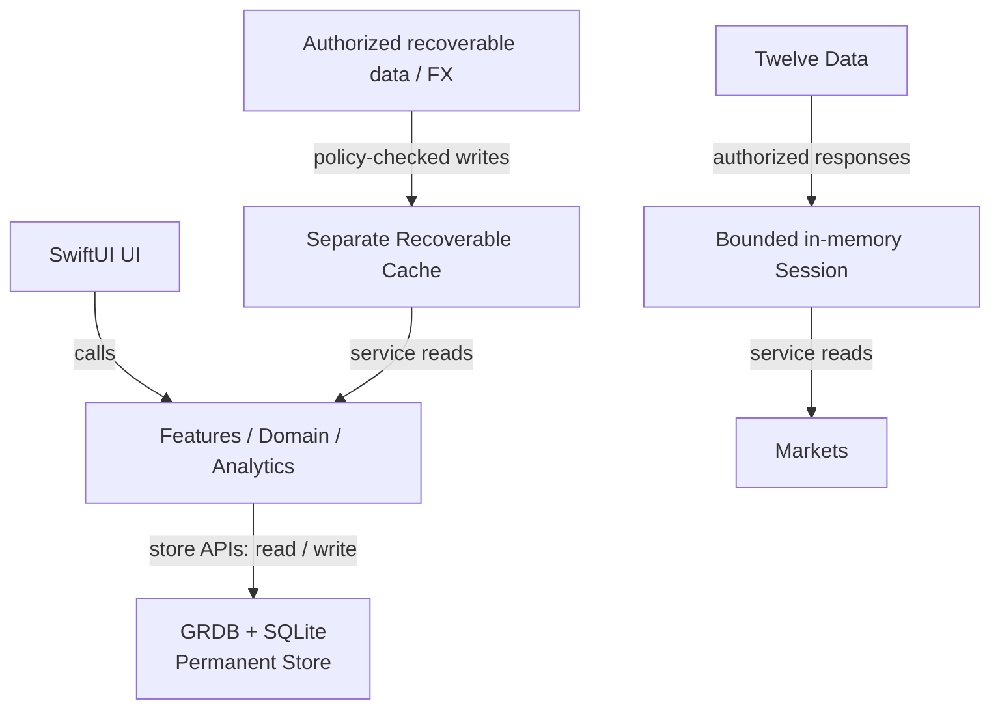

  

<h1 align="center">Aureus</h1>

Local-first personal wealth, portfolio analytics, and market terminal for macOS.

A native Mac app for understanding assets, liabilities, cash flow, and investment performance together.

  <a href="#installation">Download</a> ·
  <a href="#screenshots">Screenshots</a> ·
  <a href="docs/README.md">Documentation</a> ·
  <a href="#build-from-source">Build from Source</a>

macOS 14+ · Apple Silicon · SwiftUI · Local-first · MIT

<!-- Product screenshot: insert a verified, single-build Wealth Overview after the UI update is complete. No current development artifact has been verified for this showcase. -->

## Why Aureus

Aureus is a single-user personal wealth terminal built around financial context: what you own, how it is valued, how money moves, and how your portfolio changes over time.

- **Keep the broader picture.** Organize local accounts, assets, liabilities, and holdings alongside transactions and goals.
- **Retain currency context.** Use CNY for unified valuation while keeping a USD amount, its applied exchange rate, and its converted CNY value together.
- **Understand performance.** Explore portfolio returns, risk, and drawdown with calculations in Swift and visual summaries.
- **Separate records from market data.** Permanent wealth records have a different lifecycle from recoverable cache and transient Provider data.

## Core capabilities

### What do I own, and what changed?

Maintain local wealth records, review wealth history and allocation, and organize cash flow. The Ledger supports income, expenses, transfers, and investment events such as buys, sells, dividends, interest, and fees. Categories and tags organize those records; recording a Ledger event does not silently rewrite Wealth valuations.

### How is my portfolio doing?

Portfolio connects holdings, cost basis, activity, and recorded NAV. Analytics calculates time-weighted return (TWR), XIRR, CAGR, annualized volatility, Sharpe ratio, and maximum drawdown from local portfolio observations. Supporting data and calculation context accompany the charts. Missing valuation boundaries or insufficient observations produce explicit unavailable states rather than invented history. Calculation does not request Provider data.

### What is the market context?

Markets combines symbol search, daily price charts, volume, moving averages, RSI, and MACD with freshness and unavailable states. The 1D range means the latest daily bar, not intraday trading. A search result does not establish price-data entitlement or free real-time coverage of every market.

### What am I working toward?

Create and update financial goals, review progress, and explore contribution and return assumptions. Planning scenarios are not forecasts, investment recommendations, or guarantees.

## Screenshots

The updated showcase is awaiting completion of the UI work and a verified screenshot set. This page is a local presentation draft; no current development preview is claimed.

<!-- Gallery insertion: Wealth Overview; wealth history + allocation; Markets; Portfolio; Analytics; Ledger OR Goals. Portfolio and Analytics must be distinct real pages from the same verified build. Caption on insertion: All screenshots use illustrative, synthetic data. Retain required attribution. -->

## Architecture

Aureus uses feature-first SwiftUI and Observation, explicit dependency construction, Swift financial calculations, and GRDB over SQLite. Five implementation choices make the financial model and its lifecycle visible:

- **Local-first permanent wealth records.** An actor-owned WealthStore manages the permanent database, transactions, and versioned migrations.
- **Explicit currency / FX provenance.** Original amounts, applied rates, converted CNY values, reference dates, and stale/manual context travel together.
- **Defined return and risk calculations.** TWR, XIRR, CAGR, volatility, Sharpe, and drawdown use explicit cash-flow, date, and missing-observation rules in Swift.
- **Separate data lifecycles.** Permanent records, recoverable cache, and bounded Provider-session memory have distinct ownership and clearing paths.
- **Native macOS stack.** SwiftUI + Observation + GRDB + Swift Charts; Markets additionally hosts locally bundled Lightweight Charts in WebKit, without a runtime CDN.

This simplified diagram shows application calls and data access, not direct database dependencies for every domain type:

Permanent wealth data ≠ recoverable market cache ≠ transient provider data.

In words: features use store APIs for permanent records; Markets reads Twelve Data responses through a transient session; corresponding services use a separate cache for authorized recoverable data, including FX. Cache cleanup has no permanent-store deletion capability. FX context committed to a wealth valuation becomes part of the permanent record, not a dependency on a disposable cache entry.

Money pipeline: **checked fixed-point → Decimal calculation → explicit FX context**. Results cross declared rounding and storage boundaries; chart approximations are not authoritative financial values. See the [architecture reference](docs/V1_ARCHITECTURE.md) for the detailed decisions.

## Privacy & Data

Wealth records are stored locally. Aureus has no cloud account system, automatic brokerage synchronization, or AI/LLM capability.

Permanent records and Market Cache are isolated. Cache capacity, expiry, and cleanup must not delete permanent wealth records. Twelve Data Production data is **session-only in V1**; persistent Provider writes are disabled. Live access still depends on your own key, plan, endpoint permissions, and exchange rights.

Production credentials are entered through native Settings and stored in the application-scoped Keychain. Backups are not independently encrypted by Aureus: keep important records in independent, private backups.

Local-first does not mean never connecting to a network. Public examples must use synthetic or sanitized data; issue reports must not expose real records, keys, full logs, or private backups. Read [Privacy & Data](docs/privacy-and-data.md) for the data and Provider-rights boundaries.

## Installation

Latest release: [1.0.0 / build 1](https://github.com/freeforest/Aureus/releases/tag/v1.0.0). Official binaries target **Apple Silicon Macs with macOS 14 or later**; the deployment target is not an all-device test claim.

The binary is **ad-hoc signed, without Developer ID or Apple notarization**. Read the [distribution notes](docs/distribution.md) before installing. A matching checksum establishes file integrity relative to the supplied checksum, not trusted publisher identity.

1. Download the [DMG](https://github.com/freeforest/Aureus/releases/download/v1.0.0/Aureus-1.0.0-macos-arm64.dmg), [source ZIP](https://github.com/freeforest/Aureus/releases/download/v1.0.0/Aureus-1.0.0-source.zip), and [checksum file](https://github.com/freeforest/Aureus/releases/download/v1.0.0/SHA256SUMS) into the same folder; follow the [verification and installation steps](docs/distribution.md).
2. Keep independent private backups, copy the App to your chosen application folder without losing an existing recovery path, and eject the image.
3. Open normally, without QA arguments. Use only macOS's permitted per-app first-opening process if you trust the source. Stop on malware, damage, or tampering warnings; do not disable system protection or remove quarantine to bypass them.

## Documentation

Start with the [documentation index](docs/README.md) for user guidance and separately labeled engineering references. [Privacy & Data](docs/privacy-and-data.md) covers storage and credentials; the [verification summary](docs/evidence/release-1.0.0.md) records release boundaries.

### Build from Source

Use the clean [release source ZIP](https://github.com/freeforest/Aureus/releases/download/v1.0.0/Aureus-1.0.0-source.zip) and the [Release build & packaging guide](PUBLIC_README.md#build-from-source). It documents the Xcode / Swift baseline, pinned dependencies, and packaging workflow.

The release source archive uses that public guide as its root README. This repository presentation page is separate; it does not replace the packaging input or alter the already-published archive.

## Verification & Known Limitations

Version 1.0.0 is a formal **user-exception release**. Overall technical evidence remains **PARTIAL**. Remaining manual, performance, log-privacy, and final-App runtime verification was accepted as unfinished; repository-history safety remains **NOT VERIFIED**.

Publication and anonymous download checks succeeded, but they are not runtime acceptance. The capabilities described here reflect implementation, not comprehensive validation. Some released screens retain historical Stage / Candidate wording. Read the [1.0.0 verification summary](docs/evidence/release-1.0.0.md) and [verification index](docs/evidence/README.md) for the accepted evidence and remaining limits.

## License

Aureus-owned source is [MIT licensed](LICENSE). Third-party components retain their [own licenses and notices](THIRD_PARTY_NOTICES.md). MIT does not grant rights to Provider data or credentials. Official platform support and the Provider's personal-use restrictions are separate from the source license.
