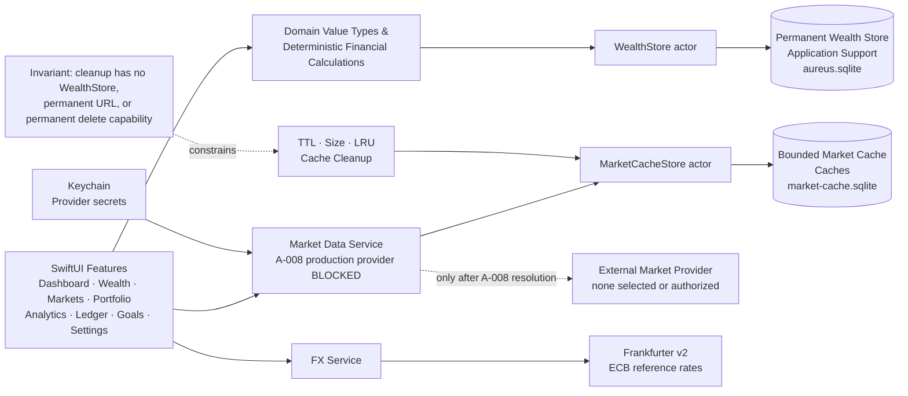

# Aureus V1 Architecture & Technology Freeze Candidate

## 1. Decision Status

**Status:** Stage 1 Freeze Candidate  
**Candidate date:** 2026-08-10  
**Approval boundary:** These decisions become the V1 technical baseline only after a Reviewer Gate decision of PASS.

The user's latest explicit instruction and root `AGENTS.md` remain authoritative. [`V1_SCOPE.md`](V1_SCOPE.md) owns product scope; this file owns the proposed implementation baseline; [`V1_RESEARCH_EVIDENCE.md`](V1_RESEARCH_EVIDENCE.md) records supporting research and uncertainty.

After approval, a frozen decision changes only through an explicit architecture change record that identifies the affected decision IDs, reason, alternatives, data/migration impact, privacy impact, testing impact, and approving authority. Repository reality may disprove completion, but it does not silently change requirements.

One core selection cannot be safely frozen: **A-008 Primary Market Data Provider is BLOCKED**. The completed nine-candidate review found no free or practically usable free plan with an official evidence chain that simultaneously resolves required United States, Hong Kong, mainland China, and Japan coverage, Search, OHLCV/adjustment needs, quota, persistent local cache, retention/deletion, attribution, and personal bring-your-own-key desktop use. Paid possibilities remain conditional on user authorization and rights confirmation. This document preserves the required market scope and describes the Provider-independent boundary; that boundary does **not** mean Stage 1 has passed and does **not** authorize Stage 2.

## 2. Decision Register

| ID | Chosen option / status | Main reason | Main tradeoff | Implementation ownership | Evidence |
|---|---|---|---|---|---|
| A-001 | macOS 14.0+, Xcode 26.6 baseline, Swift 6 mode, arm64 V1 | Native Observation/SwiftUI baseline without requiring the latest end-user OS | No macOS 13 or Intel V1 build | Stage 2 and release hardening | [Platform evidence](V1_RESEARCH_EVIDENCE.md#3-deployment-target-evidence) |
| A-002 | Feature-first SwiftUI with `@Observable`, explicit dependencies, actor ownership | Small native surface with testable boundaries | Requires deliberate state ownership and no implicit service locator | Stage 2 onward | [Apple framework evidence](V1_RESEARCH_EVIDENCE.md#3-deployment-target-evidence) |
| A-003 | One app target, one unit/integration target, one UI-test target; no internal package/framework | KISS and fast iteration | Weaker compile-time module isolation until scale proves a need | Stage 2 | [Decision trace](V1_RESEARCH_EVIDENCE.md#12-decision-traceability) |
| A-004 | GRDB 7.11.x over system SQLite; separate permanent/cache databases and migrators | Explicit SQL/schema/transaction control with a maintained Swift API | One external Stage 2 dependency and application-owned migrations | Stage 2 foundation; Stage 11 reliability | [Persistence matrix](V1_RESEARCH_EVIDENCE.md#4-persistence-comparison-matrix) |
| A-005 | Fixed-point semantic types backed by checked `Int64`; `Decimal` intermediates | Exact storage and explicit scales; no authoritative `Double` | Scale conversions and overflow checks are application responsibilities | Stage 2 onward | [Precision evidence](V1_RESEARCH_EVIDENCE.md#12-decision-traceability) |
| A-006 | CNY base; USD original + CNY-per-USD rate + converted CNY; immutable snapshot provenance | Reproducible historical valuation | More stored fields and explicit stale-rate handling | Stage 2, 3, 5 | [FX evidence](V1_RESEARCH_EVIDENCE.md#6-fx-provider-comparison-matrix) |
| A-007 | UTC instants + explicit Gregorian civil dates/IANA zones; exchange-session dates preserved | Avoids local-time and DST ambiguity | Callers must choose instant versus civil-date semantics | Stage 2 onward | [Platform evidence](V1_RESEARCH_EVIDENCE.md#3-deployment-target-evidence) |
| A-008 | **BLOCKED:** no production Primary Market Data Provider or plan selected; Provider-independent contract direction only | No usable free plan jointly verifies four-market coverage, required data, quota, cache/retention, attribution, and BYOK rights | Production market integration cannot begin; paid plan or scope decisions remain user-owned | Descriptive Stage 2 contract only; Stage 6 production work blocked | [Market matrix and Decision Packet](V1_RESEARCH_EVIDENCE.md#5-market-provider-comparison-matrix) |
| A-009 | Frankfurter v2 filtered to ECB reference rates | No key, historical CNY/USD derivation, clear ECB provenance | Reference rates are working-day valuation data, not executable quotes | Stage 2 boundary; later FX integration | [FX matrix](V1_RESEARCH_EVIDENCE.md#6-fx-provider-comparison-matrix) |
| A-010 | Dedicated GRDB cache DB; 512 MiB default, typed TTLs, LRU, 80% cleanup watermark | Bounded offline-capable cache with a provable deletion boundary | Stale-data UX and cache metadata add work | Stage 2 storage; Stage 6 UX | [Cache trace](V1_RESEARCH_EVIDENCE.md#12-decision-traceability) |
| A-011 | Swift Charts for native statistics/heatmaps; bundled Lightweight Charts 5.2.x in isolated `WKWebView` for K-line | Native accessibility for wealth views and mature financial interactions for markets | Web bridge, attribution, and native accessible fallback for K-line | Stage 5, 7 | [Chart matrix](V1_RESEARCH_EVIDENCE.md#7-chart-technology-comparison-matrix) |
| A-012 | Swift-only analytics | Meets V1 formulas without runtime/distribution complexity | Advanced quant ecosystems remain outside V1 | Stage 2 domain; Stage 9 | [Runtime comparison](V1_RESEARCH_EVIDENCE.md#8-swift-only-vs-python-comparison) |
| A-013 | `URLSession` + structured concurrency; actor rate gate; bounded retry/backoff | Native, testable networking with one concurrency owner | Provider-specific quotas still require an approved provider | Stage 2 boundary; Stage 6 production integration | [Networking sources](V1_RESEARCH_EVIDENCE.md#10-official-source-register) |
| A-014 | App Sandbox; Keychain secrets; container-scoped data; security-scoped user files; no app-layer DB encryption in V1 | Local-first privacy with system controls and minimal dependency surface | Database files/backups are not independently encrypted by the app | Stage 2, 11, 12 | [Apple security sources](V1_RESEARCH_EVIDENCE.md#10-official-source-register) |
| A-015 | Consistent DB backup, manifest/hash verification, five internal generations; unified privacy-redacted logging | Recoverable permanent data without backing up cache or secrets | V1 backups rely on user/system encrypted storage | Stage 11; Stage 12 regression hardening | [Backup trace](V1_RESEARCH_EVIDENCE.md#12-decision-traceability) |
| A-016 | Swift Testing for unit/integration; XCTest/XCUI for UI; synthetic fixtures and explicit manual provider QA | Modern unit tests plus supported UI automation | Real-provider and macOS interaction acceptance remain separate | Stage 2 onward | [Testing sources](V1_RESEARCH_EVIDENCE.md#10-official-source-register) |
| A-017 | Stage 2 dependency: GRDB only; later chart dependency: Lightweight Charts; project license authorization pending | Every dependency has a present need and permissive terms | License notices/attribution and user project-license decision remain required | Stage 2, 7, 14 | [Dependency table](V1_RESEARCH_EVIDENCE.md#9-dependency-and-license-table) |

## 3. Platform — A-001

**Decision**

- Minimum deployment target: **macOS 14.0 (Sonoma)**.
- Development baseline for Stage 2: **Xcode 26.6**, **macOS 26.5 SDK**, and the installed **Apple Swift 6.3.3** toolchain.
- Swift language mode: **Swift 6** from the first target, with strict concurrency diagnostics treated as correctness findings.
- V1 architecture: **Apple Silicon arm64 only**. A Universal Binary is excluded until an Intel build and QA matrix is explicitly authorized; this does not prevent a later compatible change.
- UI/framework baseline: SwiftUI, Observation, Foundation, Charts, WebKit, Security/Keychain, OSLog, and Uniform Type Identifiers.
- Enable App Sandbox. Request only outgoing network access and user-selected read/write file access needed by the approved feature.
- Code-signing identity, Development Team, notarization, distribution channel, and project license are **USER AUTHORIZATION_PENDING**. Agents do not create or manage those user-owned assets.

**Rationale**

macOS 14 is the first system baseline for Observation-based state used here, while Xcode 26.6 can deploy well below that version. Requiring macOS 26 would unnecessarily reduce the user base. Swift 6 mode establishes data-race checks before persistence, networking, and cache concurrency accumulate. The arm64 choice follows the Apple-Silicon-first product constraint and avoids claiming an untested Intel release.

**Rejected alternatives**

- macOS 13: rejected because it would require a different observation/state baseline or availability branches for no frozen product requirement.
- macOS 26: rejected because the installed SDK is not a reason to require the newest end-user OS.
- Universal Binary at foundation: rejected because no Intel hardware/QA evidence is currently in scope.
- Catalyst or a cross-platform UI framework: rejected because V1 is a native macOS product.

**Consequences**

The app can use macOS 14 APIs without compatibility shims. Release claims remain arm64-only until separately verified. Sandbox file access and signing must be designed from Stage 2, even though final credentials remain user-owned.

**Implementation impact**

Stage 2 creates a macOS 14 SwiftUI app target in Swift 6 mode and enables App Sandbox. It must not install or switch Xcode, create signing credentials, or assert a distribution channel.

**Evidence:** [Local toolchain and deployment evidence](V1_RESEARCH_EVIDENCE.md#2-local-toolchain-evidence).

## 4. App Architecture — A-002

**Decision**

- Use a **feature-first SwiftUI architecture**.
- Feature state models are concrete `@MainActor @Observable` types with explicit state, intents/actions, loading state, and user-presentable errors.
- Navigation uses `NavigationSplitView` and a small typed route/selection model owned by the app shell.
- Domain value types and financial calculations are pure Swift and do not import SwiftUI, GRDB, WebKit, or provider DTOs.
- Persistence and external services sit behind narrow application boundaries. Protocols are created only where substitution is required: `MarketDataProvider`, `FXRateProvider`, `Clock`, and security-scoped file interaction.
- Dependencies are built in one composition root and passed through initializers. SwiftUI Environment may carry already-constructed app-scoped dependencies; it is not a service locator.
- Persistence-store, cache-store, and network-client mutable state each have one actor owner. UI mutations remain on `MainActor`.
- Errors are typed at boundaries, mapped once to user-safe states, and logged without financial or credential content.

**Rationale**

This preserves clear feature, domain, persistence, and service boundaries without multiplying layers. Observation provides native fine-grained state tracking; initializer construction keeps dependencies visible and tests deterministic.

**Rejected alternatives**

- DI framework, event bus, plugin system, or runtime provider registry: rejected as unnecessary indirection.
- A protocol and repository class for every entity: rejected as mechanical abstraction over GRDB records and domain operations.
- Global singleton services: rejected because they hide lifecycle, actor ownership, and test substitution.
- Full Redux/TCA dependency: rejected because V1 does not need another state runtime.

**Consequences**

Some features may directly call an application service rather than pass through symmetrical layers. Cross-feature calculations must stay in Domain rather than being duplicated in view models. Dependency cycles are a design error.

**Implementation impact**

Stage 2 builds only the app shell, feature placeholders, dependency composition, and foundational domain/store contracts required by that stage. It does not create speculative protocols or provider orchestration.

**Evidence:** [Observation and SwiftUI sources](V1_RESEARCH_EVIDENCE.md#3-deployment-target-evidence).

## 5. Repository and Target Structure — A-003

**Decision**

Stage 2 uses one Xcode project and three targets:

1. `Aureus` — macOS app target.
2. `AureusTests` — Swift Testing unit and integration target.
3. `AureusUITests` — XCTest/XCUI UI-test target.

There is no independent Core target, local Swift package, framework target, helper executable, or Python target in V1 foundation. The high-level tree a separately authorized Stage 2 prompt may create is:

```text
Aureus_Wealth_Terminal/
├── Aureus.xcodeproj/
├── Aureus/
│   ├── App/
│   ├── Domain/
│   │   ├── Models/
│   │   ├── Money/
│   │   ├── Time/
│   │   └── Calculations/
│   ├── Data/
│   │   ├── Persistence/
│   │   ├── MarketData/
│   │   ├── FX/
│   │   └── Backup/
│   ├── Features/
│   │   ├── Dashboard/
│   │   ├── Wealth/
│   │   ├── Markets/
│   │   ├── Portfolio/
│   │   ├── Analytics/
│   │   ├── Ledger/
│   │   ├── Goals/
│   │   └── Settings/
│   ├── Shared/
│   │   ├── UI/
│   │   ├── Errors/
│   │   └── Accessibility/
│   └── Resources/
│       ├── Assets.xcassets/
│       ├── FinancialCharts/
│       └── SyntheticDemo/
├── AureusTests/
│   ├── Domain/
│   ├── Persistence/
│   ├── Providers/
│   ├── Cache/
│   └── Fixtures/
├── AureusUITests/
├── Config/
└── docs/
```

Only directories needed by the active stage should be materialized. `Resources/FinancialCharts` is owned by the later chart stage, not Stage 2. Fixtures and demo resources must be synthetic or sanitized and reviewed even though `.gitignore` is defensive.

**Rationale**

A single app module supports fast iteration and avoids public API/module overhead before the domain has earned separation. Feature folders expose product ownership while Domain and Data preserve the essential dependency boundary.

**Rejected alternatives**

- One Swift package per feature or layer: rejected as premature modularization.
- Separate Core/Data/Domain frameworks: rejected until build times, reuse, or access control provides measured justification.
- A single folder organized only by file type: rejected because it obscures feature ownership.

**Consequences**

Code review and conventions enforce boundaries rather than separate compilers. If later evidence justifies extraction, it requires an architecture change rather than opportunistic refactoring.

**Implementation impact**

Stage 2 may create only the minimum subset of this tree needed for the foundation prompt. No production source or project is created during Stage 1.

**Evidence:** [Decision traceability](V1_RESEARCH_EVIDENCE.md#12-decision-traceability).

## 6. Persistence and Migration — A-004

**Decision**

- Use **GRDB 7.11.x** through Swift Package Manager over Apple's system SQLite.
- Use a GRDB `DatabaseQueue` for each physical database, with access serialized through a dedicated application actor. A future switch to `DatabasePool` requires measured concurrent-read pressure and an architecture change.
- Permanent user data database, relative to the sandbox container: `Application Support/Aureus/Permanent/aureus.sqlite`.
- Recoverable market cache database, relative to the sandbox container: `Caches/Aureus/Market/market-cache.sqlite`.
- The databases have different URLs, connections, store actors, schema types, migrators, backup policies, and deletion capabilities.
- `WealthStore` owns the permanent database. `MarketCacheStore` owns the cache database. Cache cleanup receives only `MarketCacheStore`; its dependency graph contains no `WealthStore`, permanent database URL, or generic recursive-delete facility.
- Use an append-only GRDB `DatabaseMigrator` per database. Migration identifiers are immutable after release, run in order, and are covered by forward-migration fixture tests.
- A domain operation that must be atomic uses one explicit transaction: transfer legs, trade and lot changes, snapshot and its valuation inputs, and restore metadata.
- Tests use unique temporary/in-memory databases with the same migrators. No production path or real database is copied into tests.
- Backups include the permanent database through a consistent SQLite/GRDB backup operation; the market cache is excluded and can be regenerated.

> **Hard invariant:** Market Cache Cleanup cannot access, mutate, reset, or delete the permanent wealth database.

**Rationale**

GRDB provides explicit schema, SQL, transactions, migrations, backup facilities, and testable database construction while avoiding raw SQLite C-API boilerplate. The two-file boundary makes cache reset recoverable and permanent-data deletion structurally unavailable to cache code.

**Rejected alternatives**

- SwiftData: rejected because its object-model migration abstraction and newer platform availability offer less explicit SQL/fixed-point/schema control for this finance-heavy store.
- Core Data: rejected because its object-graph model and migration machinery add impedance for explicit relational schemas, fixed-point columns, and SQL-level invariants.
- Direct SQLite C API: rejected because statement binding, row decoding, concurrency, migration, and test infrastructure would be reimplemented.
- Multiple persistence stacks: rejected because V1 has one permanent-store approach and one cache-store approach using the same library, not parallel repositories.

**Consequences**

The application owns SQL schema design and migration discipline. GRDB is the sole external Stage 2 dependency. The cache can be deleted and recreated without restoring it; permanent data cannot.

**Implementation impact**

Stage 2 adds GRDB 7.11.x, creates separate store configurations and empty versioned schemas, and adds migration/isolation tests. It must not implement feature tables beyond the active Stage 2 contract or create any database in the Repository.

**Evidence:** [Persistence comparison](V1_RESEARCH_EVIDENCE.md#4-persistence-comparison-matrix).

## 7. Money, Quantity, Price, and Precision — A-005

**Decision**

Authoritative values are distinct semantic types. They are not interchangeable aliases and do not persist `Double`.

| Value | Persistent representation | Runtime authoritative representation | Scale and validation |
|---|---|---|---|
| `Money` | SQLite `INTEGER minor_units` + `TEXT currency_code` | Checked `Int64` minor units + supported currency | Scale 2 for CNY and USD. Currency must be uppercase and in the V1 allowlist. |
| `AssetQuantity` | SQLite `INTEGER coefficient` + fixed schema scale | Checked `Int64` coefficient | Scale 8; signed only where a domain operation explicitly permits it. |
| `MarketPrice` | SQLite `INTEGER coefficient` + quote currency + source time | Checked `Int64` coefficient | Scale 8; must be nonnegative and currency-valid. |
| `FXRate` | SQLite `INTEGER coefficient` + source/target + provenance | Checked `Int64` coefficient | Scale 10; strictly positive except a missing value is represented as absence, never zero. |
| `Percentage` / ratio | Persist only when required as `INTEGER coefficient` + semantic field | Foundation `Decimal` | Scale 10 when persisted; dimensionless and range-validated per metric. |

- Use Foundation `Decimal` for multiplication, division, return/risk formulas, and conversions, with working scale **16 decimal places**.
- Apply **round half to even** (`bankers`) only at a declared result boundary. Money rounds to the currency scale; quantity, price, and FX rate round only to their own declared scale.
- Store both numerator inputs and provenance where later recalculation matters; do not persist chart-rendering approximations as financial authority.
- Convert to `Double` only in the final visualization adapter because chart APIs may require binary floating point. The domain value remains available for labels, tooltips, and assertions.
- All construction, addition, multiplication-to-coefficient, and rescaling operations use checked arithmetic. Overflow, unsupported currency, non-finite imported text, negative-forbidden values, and excess fractional precision produce validation errors rather than truncation.
- CSV parsing uses locale-independent canonical decimal text after an explicit import-locale choice. Display formatting uses the user's locale and currency symbol without changing stored values.

**Rationale**

Fixed-point integers make stored equality, sums, constraints, indexes, and migrations deterministic. Separate scales reflect different financial semantics. Decimal intermediates avoid binary floating-point authority without forcing every calculation into one scale.

**Rejected alternatives**

- `Double` for persisted money or core calculations: rejected because decimal currency values are not generally exact in binary floating point.
- One universal decimal number type for money, quantity, price, FX, and ratios: rejected because it erases currency and scale semantics.
- Decimal-as-text for all columns: rejected because it weakens constraints, ordering, aggregation, and migration clarity.

**Consequences**

Adapters and explicit conversions are required. V1 supports CNY/USD scale rules only; additional currencies require a reviewed currency metadata change. Performance tests must include fixed-point conversions and aggregates.

**Implementation impact**

Stage 2 defines these value types, checked conversions, SQLite mappings, and boundary tests before feature schemas depend on them.

**Evidence:** [Precision decision trace](V1_RESEARCH_EVIDENCE.md#12-decision-traceability).

## 8. Currency and FX — A-006 and A-009

**Decision**

- The unified valuation currency is **CNY**.
- The canonical direction is **CNY per 1 unit of source currency**. For USD, `USD/CNY` in this application means “CNY for 1 USD”; fields use explicit names (`sourceCurrency`, `targetCurrency`, `cnyPerSource`) to avoid ticker ambiguity.
- A USD value retains: original USD `Money`, FX coefficient/scale, source `USD`, target `CNY`, provider, provider/reference date, fetch instant, stale/carried-forward state, and converted CNY `Money`.
- CNY-to-CNY uses an exact rate of 1.0000000000 with source `identity`; it performs no network request.
- Primary V1 FX provider: **Frankfurter v2 with `providers=ECB`**, using ECB reference rates. USD-to-CNY is a declared derived cross-rate from the EUR reference legs, not an executable quote.
- Attribution in applicable data surfaces: “ECB reference rates via Frankfurter”; derived rates are labeled as derived. ECB rates are for valuation/information, not transaction execution.
- For a requested civil valuation date, use the most recent provider reference rate on or before that date. Never use a future rate. Weekend/holiday carry-forward stores the original reference date and `carriedForward=true`.
- A live dashboard may show the last cached rate with its actual reference/fetch time and a visible stale state. Missing FX never silently becomes 1 and never silently removes an asset from totals.
- An automatic snapshot is blocked when the most recent applicable rate is more than **7 calendar days** older than the snapshot date. A user may explicitly accept the stale rate; that override and provenance are stored.
- Every snapshot persists the original amount/currency, applied rate/direction/source/reference date/fetch time, converted CNY amount, and stale/override state. Historical snapshots are not rewritten when later rates arrive.
- Converted CNY uses Decimal working precision and round-half-to-even at CNY scale 2.

**Rationale**

The representation preserves original economic facts and makes every aggregate reproducible. Frankfurter provides a keyless official API over central-bank datasets, while ECB gives a clear working-day timestamp and reuse/attribution basis.

**Rejected alternatives**

- Alpha Vantage FX: rejected for V1 because current official quota pages conflict and a key/terms dependency is unnecessary for reference FX.
- Provider-agnostic runtime switching: rejected because V1 needs one source, not a multi-provider platform.
- Recomputing all historical snapshots from the newest rate: rejected because it destroys historical provenance.
- Treating missing USD rates as 1 or zero: rejected as materially misleading.

**Consequences**

ECB working-day data is not intraday and can be stale over closures. Derived USD/CNY carries two-leg provenance. Provider/schema tests must assert direction and date semantics.

**Implementation impact**

Stage 2 defines `FXRateProvider`, `FXRate`, and snapshot provenance types plus a deterministic mock. Live Frankfurter integration belongs to the authorized market/FX service stage and must follow caching/attribution rules.

**Evidence:** [FX provider comparison](V1_RESEARCH_EVIDENCE.md#6-fx-provider-comparison-matrix).

## 9. Time, Time Zone, and Trading Calendar — A-007

**Decision**

- Persist instants as signed `Int64` Unix epoch milliseconds in UTC.
- Persist a date-only fact as canonical Gregorian `YYYY-MM-DD` text, never as midnight UTC. Store the relevant IANA time-zone identifier alongside it when interpretation depends on a zone.
- User-entered transaction dates use the user's selected local time zone at entry; the original civil date and zone remain authoritative for ledger grouping.
- Market bars preserve provider symbol/exchange identity, exchange-local session date, exchange IANA zone, interval, open/close UTC instants when supplied, and provider timestamp.
- Net-worth snapshot date is the user's local Gregorian civil date. Its creation time is a separate UTC instant.
- Day boundaries for personal cash flow use the user-selected local zone. Market session boundaries use the exchange zone, including daylight-saving transitions.
- A V1 trading calendar is evidence-driven: use returned session dates plus exchange/time-zone metadata. Do not synthesize holiday sessions and do not forward-fill missing OHLCV bars. A last close may be carried for valuation only when labeled with its actual session and stale state.
- Inject a small `Clock` dependency (`now` instant) and pass `Calendar`/`TimeZone` explicitly to date-sensitive domain functions. No global “current date” call appears inside financial calculations.
- Tests include Shanghai, New York DST transitions, Tokyo, and a fixed user-zone case, with weekend, leap-day, year-boundary, and exchange-holiday fixtures.

**Rationale**

An instant, a user civil date, and an exchange session are different facts. Separating them prevents UTC-midnight drift, DST errors, and invented trading days.

**Rejected alternatives**

- Storing all dates as UTC midnight: rejected because date-only facts can move a day when rendered elsewhere.
- Device default time zone inside calculations: rejected because results become environment-dependent.
- A hard-coded weekend-only market calendar: rejected because exchange holidays and exceptional sessions differ.

**Consequences**

Schemas carry more temporal metadata, and imports must identify date semantics. Historical bars remain sparse rather than cosmetically filled.

**Implementation impact**

Stage 2 establishes instant/date/session value types, Clock injection, and DST/date tests before ledger and market models use them.

**Evidence:** [Apple Foundation and concurrency register](V1_RESEARCH_EVIDENCE.md#10-official-source-register).

## 10. Market Data Provider — A-008

**Decision status: BLOCKED — Result B**

No production V1 Primary Market Data Provider or plan is selected. The review covers Yahoo Finance/yfinance, Alpha Vantage, Stooq, Twelve Data, Marketstack, Tiingo, EODHD, Finnhub, and Financial Modeling Prep (FMP). Current official evidence does not prove a free or practically usable free plan satisfies the frozen United States, Hong Kong, mainland China, and Japan scope together with Symbol Search, historical OHLCV, required adjustment/corporate-action semantics, workable quota, persistent local-cache permission, termination deletion, attribution, and each user's own-key desktop use.

The provider-independent boundary is frozen so foundation work does not depend on a vendor:

```swift
protocol MarketDataProvider: Sendable {
    func searchSymbols(query: String) async throws -> [MarketSymbol]
    func marketStatus(for exchanges: Set<ExchangeID>) async throws -> [ExchangeStatus]
    func historicalBars(_ request: HistoricalBarsRequest) async throws -> HistoricalBarsPage
    func corporateActions(_ request: CorporateActionsRequest) async throws -> [CorporateAction]
}
```

This is a type sketch, not production code. Domain-facing values carry symbol, exchange/MIC, currency, interval, timestamps/session dates, provider identifier, adjustment state, and provenance. Provider JSON models never enter Domain. The boundary does not expose a dynamic plugin registry or automatic provider fallback.

If and only if a later Stage 2 prompt is separately authorized after the Reviewer Gate, Stage 2 is limited to the protocol, value contracts needed by compilation, and a deterministic in-memory synthetic provider. This Provider-independent direction is not evidence that Stage 1 passed and is not authorization to enter Stage 2. It must not create an API account, key, network client for a market vendor, SDK dependency, or production provider implementation.

When a production provider is authorized:

- Its API key is stored in Keychain and never source, settings files, logs, fixtures, or backups.
- The provider's documented quota is enforced by an actor rate gate; the stricter verified limit wins.
- Provider errors map to typed authentication, quota, unavailable, malformed-data, unsupported-market, and terms/entitlement states.
- Cached responses retain provider and timestamp; offline/stale presentation is explicit.
- Required attribution is shown and included with exported provider-derived data when terms require it.
- A real-provider acceptance run is separate from deterministic provider contract tests.

**Decision boundary required to unblock production market work**

The evidence-backed choices are recorded in the [User Decision Packet](V1_RESEARCH_EVIDENCE.md#57-user-decision-packet). They are: keep the complete market scope and keep A-008 blocked; explicitly authorize a named paid provider/plan followed by current entitlement and rights confirmation; or explicitly approve a V1 market-coverage change. The Executor selects none of these. A paid plan is not authorized by appearing in research, and no market is removed by omission.

**Rationale**

Selecting a convenient endpoint without coverage and rights evidence would turn a product requirement into operational/legal debt. A small boundary and mock allow domain, persistence, cache, and UI foundation to remain vendor-neutral without building a multi-provider platform.

**Rejected or unverified candidates**

- Yahoo Finance/yfinance — rejected: yfinance identifies itself as an unofficial research/education wrapper and Yahoo data as personal-use subject to Yahoo terms; it is not a production client API contract.
- Alpha Vantage — rejected: official pages conflict on free quota and do not verify the complete required market/tier/rights matrix.
- Stooq — unverified: no accessible formal API, pricing/quota, usage, or attribution documentation was established.
- Twelve Data — rejected as current primary, retained only as conditional leader: full required exchanges are paid-tier features and precise cache/display rights require authorized subscription review.
- Marketstack — rejected: the directly readable official FAQ conflicts internally on free quota, the official Pricing page was inaccessible in this execution, and exact four-market tier/rights evidence is incomplete.
- Tiingo — rejected: Starter explicitly prohibits persistent storage, and the EOD exchange list verifies US and mainland-China A-shares but does not list or establish Hong Kong or Japan.
- EODHD — rejected on the free plan: 20 calls/day is not practically usable at 30/100-symbol refresh scenarios; the paid All World plan is unauthorized and the current official EOD exchange list does not establish Hong Kong and Tokyo price coverage even though a separate trading-hours endpoint knows `XHKG` and `XTKS`.
- Finnhub — unverified/rejected as Primary: the official dynamic Pricing and API pages returned no readable body in this execution, while the readable Terms page alone cannot establish a current free or paid four-market capability and entitlement chain.
- Financial Modeling Prep (FMP) — rejected on the free plan: Basic is a US-limited five-year plan; Global Coverage is on the unauthorized Ultimate plan, and personal-use application/display and cache-deletion terms require an applicable agreement.

**Consequences**

Production market calls and vendor-specific acceptance are blocked. The required Markets feature scope remains in V1 and is not represented as completed by mock data, protocol compilation, or cache tests. A user budget or product-scope decision is required before the blocker can be reviewed again.

**Implementation impact**

A future, separately authorized Stage 2 may implement only compile-time contracts and synthetic mocks. This statement does not authorize Stage 2 while the Stage 1 Gate is unresolved. Any production integration requires a new explicit authorization that resolves this decision and updates A-008 evidence.

**Evidence:** [Market provider matrix](V1_RESEARCH_EVIDENCE.md#5-market-provider-comparison-matrix) and [conflicts](V1_RESEARCH_EVIDENCE.md#11-unverified-or-conflicting-facts).

## 11. Market Cache — A-010

**Decision**

The market cache is recoverable, bounded, and physically separate from permanent data.

### Capacity

- Default maximum: **512 MiB**.
- User-configurable range: **128 MiB to 4 GiB**.
- High-water cleanup trigger: **90%** of configured maximum.
- Cleanup low-water target: **80%** of configured maximum.
- If cleanup cannot reach the limit, reject the new cache write and keep the app/permanent store operational.

### TTL and retention

| Cache record | Refresh TTL / retention |
|---|---|
| Latest quote and market status | 15 minutes |
| Symbol search, symbol metadata, exchange metadata | 7 days |
| EOD bars whose session is within the latest 30 calendar days | 12 hours |
| EOD bars older than 30 calendar days | 30 days before refresh; retained subject to LRU/capacity |
| Intraday bars | 15 minutes refresh TTL; maximum retention 30 calendar days |
| Derived market heatmap | 15 minutes |
| Derived indicator series | 24 hours, or immediate invalidation when source bars/revision change |
| FX HTTP responses | 24 hours; a rate committed to a permanent snapshot is permanent data, not cache |

TTL expiry means “eligible for refresh/removal,” not proof that a network response is available. Offline reads may use expired records with a visible provider timestamp and stale state.

### Metadata and cleanup

- Every entry records provider, logical key, byte size, created/fetched time, expiry, last access, source revision, and data type.
- Update last-access metadata in bounded batches so reads do not create unbounded write amplification.
- Automatic check occurs at launch when the last check is older than 24 hours, every 6 hours while the app remains active, after a write crosses 90%, and best-effort on background/termination.
- Cleanup order: expired derived/heatmap/indicator entries; expired intraday; expired quote/search metadata; then least-recently-used recoverable OHLCV until 80% is reached.
- There are no V1 cache pins. Re-fetchable records are evicted rather than exempted indefinitely.
- Manual cleanup offers “remove expired” and “reset market cache.” Reset closes only the cache connection, removes/recreates only `market-cache.sqlite` and its SQLite sidecars, runs only the cache migrator, and never receives the permanent-store URL.
- Settings displays current bytes, configured cap, percentage used, last cleanup result/time, oldest entry, provider breakdown, and stale/offline status.
- After eviction, the app re-fetches on demand when online; offline misses show unavailable rather than fabricated values.

### Safety proof obligation

Automated isolation tests create two distinct temporary files, seed sentinel permanent rows, invoke every cleanup/reset path at capacity, and verify the permanent file URL, hash, schema version, and sentinel rows are unchanged. Static dependency review confirms cache cleanup has no permanent-store capability. This evidence is required; a successful cache-row deletion alone is insufficient.

**Rationale**

Explicit numbers make storage behavior testable. Typed TTLs reflect different volatility while the two-database/capability boundary protects permanent wealth records.

**Rejected alternatives**

- Unbounded cache or “system decides”: rejected because market history can grow indefinitely.
- One database with permanent and cache tables: rejected because reset/cleanup could cross the deletion boundary.
- TTL-only cleanup: rejected because valid historical data can still exceed capacity.
- Blanket cache deletion at every launch: rejected because it breaks offline behavior and wastes provider quota.

**Consequences**

Cache metadata consumes space and access updates need batching. Offline views must distinguish fresh, stale, and missing. Cache reset never participates in backup/restore.

**Implementation impact**

A separately authorized Stage 2 establishes only the separate cache database foundation, configuration values, and isolation tests. Production fetch caching belongs to Stage 6; Settings cache controls belong to Stage 11.

**Evidence:** [Persistence and cache decision trace](V1_RESEARCH_EVIDENCE.md#12-decision-traceability).

## 12. Visualization and Financial Charts — A-011

**Decision**

### Native statistics and heatmaps

- Use **Apple Swift Charts** for Dashboard, Wealth, allocation, cash-flow, net-worth, expense, portfolio, and standard time-series charts.
- Use Swift Charts vectorized plots/marks or a small native SwiftUI/Canvas layout for heatmaps, selected by measured cell count and accessibility behavior; no third-party general chart dependency is introduced.
- Native charts expose text summaries, chart descriptions, selection values, high contrast, keyboard/focus behavior, Dynamic Type where applicable, VoiceOver labels, and reduced-motion behavior.

### Professional financial chart

- Use **TradingView Lightweight Charts 5.2.x**, bundled as offline local assets in the app and hosted in an isolated `WKWebView`.
- Never load the library from a CDN. The chart web view receives only public/provider market series and non-sensitive display configuration; it never receives accounts, holdings, trades, wealth totals, file URLs, API keys, Keychain values, or arbitrary navigation permission.
- Support candlestick and volume panes, zoom, pan, crosshair, tooltip, and time-range changes through a narrow Codable message bridge.
- Compute MA, EMA, RSI, MACD, and Bollinger Bands deterministically in Swift Domain calculations; pass result series to the chart. JavaScript does presentation and interaction, not financial authority.
- Bundle the Apache-2.0 license and NOTICE, preserve notices, and show the TradingView attribution/link required by the project's attribution notice.
- Provide a native accessible summary and data table for the visible range, keyboard range controls outside the web view, and clear current-value/indicator text. The canvas chart alone is not the accessibility surface.
- Performance tests cover 10,000 daily bars, bridge payload size, first render, pan/zoom responsiveness, memory, repeated range changes, offline load, and no external network requests.

**Rationale**

Swift Charts gives native integration and accessibility for wealth visualization. Lightweight Charts directly supports candlesticks, histogram/volume, time-scale navigation, crosshair, and custom/plugin series with a permissive license; it avoids building a financial interaction engine from scratch.

**Rejected alternatives**

- Swift Charts alone for professional K-line: rejected because composing production-grade synchronized candles/volume/crosshair/pan/zoom/indicator behavior would create significant custom interaction and test work.
- DGCharts as the professional chart: rejected because its official baseline and SwiftUI/macOS integration evidence are less current/direct for this app, despite candlestick and pan/zoom support.
- Static images or ordinary line charts: rejected because they do not satisfy the required interactions.
- Remote TradingView widget/CDN: rejected for offline, privacy, sandbox, and deterministic-version reasons.

**Consequences**

The K-line surface carries a web runtime and license/attribution duties. Accessibility needs a parallel native representation. The JS artifact enters only at the authorized chart stage, not Stage 2.

**Implementation impact**

Stage 2 adds no chart dependency. Native statistics begin with feature stages; Lightweight Charts is pinned, reviewed, bundled, and bridge-tested in Stage 7.

**Evidence:** [Chart technology comparison](V1_RESEARCH_EVIDENCE.md#7-chart-technology-comparison-matrix).

## 13. Analytics Runtime — A-012

**Decision**

- V1 is **Swift-only**. Do not embed, install, launch, or require Python.
- Financial formulas live in `Aureus/Domain/Calculations`, separated by semantic area (cash flow, return, risk, portfolio, goals).
- Each public formula documents units, sign convention, date convention, annualization basis, treatment of missing observations, edge cases, and a primary reference.
- Calculations are deterministic pure functions over semantic values and explicit date/clock inputs. They do not fetch network data, query the database, inspect locale, or access SwiftUI state.
- Golden tests use small hand-verifiable synthetic cases and independent reference values; property/invariant tests cover transfer neutrality, monotonic compounding, scale/rounding, and empty/degenerate inputs.
- No AI or LLM library, model, endpoint, classification, advice, or agent capability may enter the product.

**Rationale**

V1 metrics are implementable with Swift and Decimal/fixed-point inputs. Python would add runtime packaging, sandbox, launch, architecture, dependency, and support complexity without a required V1 capability.

**Rejected alternatives**

- Bundled Python and scientific stack: rejected under KISS/YAGNI and distribution/privacy costs.
- A separate analytics service/process: rejected because it creates IPC and deployment complexity for deterministic local formulas.

**Consequences**

The team owns careful formula implementations and reference tests. Advanced quantitative ecosystems remain deferred rather than partially bundled.

**Implementation impact**

Stage 2 creates only calculation structure and foundational numeric tests; Stage 9 owns the required metrics.

**Evidence:** [Swift-only versus Python comparison](V1_RESEARCH_EVIDENCE.md#8-swift-only-vs-python-comparison).

## 14. Networking, Concurrency, and Rate Limits — A-013

**Decision**

- Use Foundation `URLSession` async APIs with `Codable` boundary DTOs. No networking SDK or third-party HTTP client.
- One actor-owned client per approved external service owns request construction, authentication, quota state, in-flight deduplication, and response decoding.
- Default maximum is **2 concurrent external requests per provider**, reduced when the provider's verified quota requires it.
- Apply the strictest current official quota. If a quota is unknown or conflicting, production integration remains disabled rather than guessing.
- Request timeout: **30 seconds**; resource timeout: **60 seconds**.
- Retry only idempotent GET requests after transient network failures, HTTP 408, 429, or 5xx. Maximum **3 retry attempts** after the initial request, with approximately **1, 2, and 4 seconds** exponential delay plus bounded jitter; honor `Retry-After` when present. Do not retry authentication, entitlement, validation, or decoding failures.
- Cancel work when the owning task is cancelled. Do not detach unstructured tasks for ordinary requests.
- Cache-first/offline behavior follows A-010. Network success never writes directly to permanent financial records without domain validation and an explicit transaction.
- Rate-limit, auth, connectivity, entitlement, unsupported market, malformed payload, and stale-cache states remain distinct.

**Rationale**

System networking and structured concurrency meet V1 needs. A single actor owner makes quotas and request deduplication testable without locks or a global event bus.

**Rejected alternatives**

- Third-party HTTP stack: rejected because no required capability exceeds `URLSession`.
- Unlimited parallel fetches: rejected because it wastes quota and makes ordering/error behavior unstable.
- Generic retry of every failure: rejected because it amplifies bad credentials, terms failures, and malformed data.

**Consequences**

Provider adapters must translate provider-specific pagination and limits into the small domain boundary. Exact production quotas cannot be configured until A-008 is resolved.

**Implementation impact**

Stage 2 may define testable request policy primitives if required by an authorized foundation prompt. It may not implement a production market provider while A-008 is blocked.

**Evidence:** [Apple URLSession/concurrency and provider sources](V1_RESEARCH_EVIDENCE.md#10-official-source-register).

## 15. Privacy, Keychain, Sandbox, and Data Locations — A-014

**Decision**

All paths below are relative to the signed app's sandbox container and are resolved through Foundation APIs; no user-specific absolute path is embedded:

| Data class | V1 location and rule |
|---|---|
| Permanent database | `Application Support/Aureus/Permanent/aureus.sqlite`; never inside Repository, Caches, temporary directories, demo resources, or logs. |
| Market cache | `Caches/Aureus/Market/market-cache.sqlite`; recoverable and excluded from backup. |
| Internal backups | `Application Support/Aureus/Backups/`; maximum five validated generations. |
| User export/import/backup destination | User-selected URL through standard open/save panel with scoped access only for the operation; persistent security-scoped bookmarks only when a frozen feature truly requires recurring access. |
| API keys and provider secrets | Keychain item scoped to the app/service/account; never `UserDefaults`, plist, environment file, source, database, backup, export, fixture, analytics, or log. |
| Preferences without secrets | `UserDefaults` for non-sensitive display/configuration only. |
| Logs | Unified OSLog only, privacy-redacted; no repository/local log file by default. |
| Demo/test data | Explicit synthetic resources and temporary test stores; separate launch configuration and never derived from a real store. |

- App Sandbox is enabled from foundation. Entitlements are least-privilege: outgoing network and user-selected file read/write only when used.
- Security-scoped access begins immediately before file work and ends immediately after it. Imported content is validated before permanent transactions.
- Logs may include stable error category, subsystem, operation, duration bucket, record count, provider, and HTTP status. Logs must not contain account names, filenames chosen by the user, amounts, holdings, symbols tied to a portfolio, transaction descriptions, raw payloads, API keys, tokens, database rows, or identifying paths.
- V1 does **not** add application-layer database encryption such as SQLCipher. It relies on the sandbox and the user's macOS data-at-rest protection; Keychain protects secrets. The Settings/privacy documentation must state that database and backup files are not independently encrypted by Aureus.
- Adding application-layer encryption is conditional future work requiring threat-model, key recovery, migration, backup/restore, search/index, performance, export, and dependency/license review.

**Rationale**

System sandbox and Keychain provide native boundaries without adding a cryptographic database dependency that V1 cannot safely recover. Explicit data locations keep recoverable cache, permanent data, and user exports distinct.

**Rejected alternatives**

- Storing keys in `.env`, preferences, or SQLite: rejected because those locations are not a secret store.
- Disabling App Sandbox for convenience: rejected because it weakens the local privacy boundary and conflicts with Mac App Store distribution.
- Claiming database encryption without a frozen key/recovery design: rejected as unsafe and misleading.

**Consequences**

V1 database/backups depend on host/user disk protection and user handling. File import/export needs sandbox-aware UI tests. Diagnostics are less detailed by design.

**Implementation impact**

Stage 2 configures sandbox paths and a Keychain boundary without adding real keys. Stage 11 owns credential UX, privacy/data-lifecycle file flows, backup/restore, and migration reliability; Stage 12 owns UX/performance/regression hardening.

**Evidence:** [Apple Sandbox, Keychain, and OSLog sources](V1_RESEARCH_EVIDENCE.md#10-official-source-register).

## 16. Backup, Restore, and Logging — A-015

**Decision**

- Create a consistent SQLite/GRDB backup while the source database remains under store ownership; do not copy a live database file with generic file copy.
- Offer on-demand internal backup and create one before every permanent-schema migration.
- Keep the newest **five successfully validated** internal backup generations. Prune only after the new backup's manifest and hash validate.
- Manifest includes app version, schema version, creation UTC instant, database byte count, SHA-256, and backup format version. It contains no financial summary or credentials.
- Backup includes the permanent database and required manifest only. Exclude Market Cache, SQLite cache sidecars, Keychain secrets, logs, temporary imports, and generated chart assets.
- Restore sequence: close permanent access; validate manifest/hash/format/schema compatibility; create a safety backup of the current store; stage the candidate in the permanent-data filesystem; atomically replace; run forward migrations; open and run integrity/application invariants; roll back to the safety backup on failure.
- Never restore a database directly from an unvalidated user-selected path. Never replace the current store before a recoverable safety copy exists.
- Manual external backup/export uses a user-selected destination. V1 backup artifacts are not encrypted by Aureus, so the UI warns the user to choose encrypted private storage.
- Use unified OSLog with private-by-default interpolation and the data exclusions in A-014. No persistent sensitive log cache is created.

**Rationale**

Transaction-consistent backup plus manifest/hash verification provides recoverability without confusing cache or secrets with permanent data. Five generations bound storage and preserve rollback options.

**Rejected alternatives**

- Raw copy of an open SQLite database: rejected because it can miss transaction/WAL state.
- Backing up the whole sandbox container: rejected because it includes recoverable cache and may include secrets/temporary data.
- One overwrite-only backup: rejected because corruption may replace the only recovery point.

**Consequences**

Restore requires an explicit maintenance state and failure UX. Unencrypted backup is a documented V1 limitation, not a privacy guarantee.

**Implementation impact**

Stage 11 implements and tests this flow; Stage 2 only ensures the permanent/cache path split and migration hooks support it, and Stage 12 performs cross-feature regression hardening.

**Evidence:** [GRDB and Apple privacy evidence](V1_RESEARCH_EVIDENCE.md#9-dependency-and-license-table).

## 17. Testing Strategy — A-016

**Decision**

- **Swift Testing** is the default for domain, persistence, service, migration, and integration tests.
- **XCTest/XCUI** is used for macOS UI automation and launch/performance scenarios that require Xcode UI-test APIs.
- Use parameterized tests and traits where they improve financial edge-case coverage; keep shared synthetic fixtures explicit and small.

Required suites:

| Area | Required evidence |
|---|---|
| Money/precision | Construction, rescaling, round-half-even ties, overflow, unsupported currency, locale-independent parsing, Decimal-to-fixed conversion. |
| FX | Direction, identity rate, cross-rate, reference date, weekend carry, stale/missing behavior, 7-day snapshot rule, immutable snapshot provenance. |
| Ledger/transfer | Balanced transfer legs, aggregate neutrality, fees, rollback, duplicate import, deterministic classification. |
| Cost basis/portfolio | Buy/sell lots, partial sales, fees, realized/unrealized P&L, NAV, benchmark edge cases. |
| Time/calendar | UTC instant round-trip, civil dates, DST gaps/folds, leap day, user versus exchange zone, sparse holiday sessions, injected clock. |
| Persistence/migration | Fresh schema, every supported previous-version fixture migrated forward, failed migration rollback, constraints/indexes, reopen. |
| Backup/restore | Consistent backup, manifest/hash rejection, safety backup, restore/migrate, failure rollback, cache/key exclusion. |
| Cache isolation | TTL order, capacity/LRU, offline stale read, failed write, reset, and proof that permanent URL/hash/schema/sentinel data are unchanged. |
| Provider contracts | Deterministic synthetic provider for success, pagination, quota, auth, malformed, cancellation, retry, unsupported market, and stale cache. |
| Charts | Swift-to-JS schema, no sensitive fields, offline resource load, candlestick/volume/indicator alignment, range/zoom/pan/crosshair/tooltip, native accessible fallback. |
| UI/accessibility | Navigation, keyboard/focus, VoiceOver labels, import/restore confirmations, stale/offline/error states, demo/production separation. |

Synthetic fixture policy:

- Names and content explicitly identify fictional data.
- Fixtures contain no copied bank/broker export, personal path, key-like token, or real account/holding history.
- Provider payload fixtures are hand-authored/minimized or used only when provider terms explicitly permit storage and redistribution; otherwise map them into synthetic contract values.
- Local mock success never counts as real-provider coverage, entitlement, quota, terms, latency, or attribution acceptance.

Candidate performance gates, measured in Release configuration on an Apple M2 baseline or documented equivalent:

- Launch to usable shell with 10,000 synthetic ledger entries: p95 at or below **2.0 seconds**.
- Warm Dashboard aggregate over 10,000 entries: p95 at or below **250 ms**.
- First Ledger page from 100,000 synthetic entries: p95 at or below **200 ms** warm.
- K-line first render of 10,000 bars: at or below **1.0 second**; pan/zoom p95 at or above **45 fps**.
- Capacity cleanup at configured maximum: at or below **5 seconds**, off the main actor, with permanent-store isolation evidence.

Manual macOS QA remains required for VoiceOver quality, keyboard-only workflows, security-scoped panels, backup/restore confirmation, offline behavior, chart interaction, appearance/contrast, and signed sandbox behavior. Automated passes do not prove those observations.

**Rationale**

Swift Testing covers deterministic Swift logic and integration well, while XCUI remains the supported application UI automation path. Finance/data-boundary risks require focused regression suites and independent manual evidence.

**Rejected alternatives**

- UI-only testing: rejected because it cannot exhaust numeric, migration, or failure invariants.
- Snapshot-only chart testing: rejected because it does not prove interaction, accessibility, or data semantics.
- Real personal exports as fixtures: prohibited by governance.

**Consequences**

Performance numbers are candidate gates and must be measured on a recorded machine/configuration. Real-provider QA remains blocked with A-008.

**Implementation impact**

Stage 2 creates both test targets and foundational suites. Later stages add coverage with each domain feature rather than postponing all tests.

**Evidence:** [Apple testing sources](V1_RESEARCH_EVIDENCE.md#10-official-source-register).

## 18. Dependencies and Licensing — A-017

**Decision**

- **Stage 2 external dependency: GRDB 7.11.x only**, pinned through Swift Package Manager according to the Stage 2 prompt. It is necessary for explicit SQLite persistence, migration, transactions, and backup.
- **Later Stage 7 asset/dependency: TradingView Lightweight Charts 5.2.x**, pinned and bundled locally with Apache-2.0 license/NOTICE and required attribution. It is not added during Stage 2.
- Use system SQLite, Foundation, SwiftUI, Observation, Charts, WebKit, Security, OSLog, and XCTest/Swift Testing; these are platform/toolchain components rather than copied third-party packages.
- Frankfurter is accessed as an HTTP API without an SDK dependency. Its server's MIT license does not replace the data/provider/ECB terms and attribution review.
- Do not add an SDK for a blocked Market Provider.
- Recommended project source license: **Apache License 2.0**, because its permissive terms and patent grant align with the planned open-source desktop app and the later Apache-2.0 chart dependency. This is a recommendation only: **USER AUTHORIZATION_PENDING**. No LICENSE file is created and no user choice is claimed.

**Rationale**

Each dependency has a direct frozen need. System frameworks cover networking, general charts, UI, concurrency, secrets, and logging, leaving only database ergonomics at Stage 2 and the professional chart engine later.

**Rejected alternatives**

- Adding packages for DI, networking, dates, logging, money, or generic charts: rejected because system APIs and small domain code cover V1 requirements.
- Adding Lightweight Charts in Stage 2: rejected because no Stage 2 screen needs it.
- Choosing the project license on the user's behalf: prohibited.

**Consequences**

Dependency update work must re-run license, maintenance, compatibility, and regression review. Distribution must preserve third-party notices and attribution.

**Implementation impact**

Stage 2 resolves only GRDB. Stage 7 owns the offline chart asset. Stage 14 validates notices and records the user-authorized project license.

**Evidence:** [Dependency/license table](V1_RESEARCH_EVIDENCE.md#9-dependency-and-license-table).

## 19. Architecture Diagram



There is deliberately no edge from `CacheCleanup` or `MarketCacheStore` to `WealthStore` or the permanent database. FX provenance committed to a snapshot crosses into permanent data only through a validated Domain operation and WealthStore transaction; raw HTTP cache remains recoverable.

## 20. Stage 2 Implementation Contract

Stage 2 may rely on the following freeze-candidate contract only after Reviewer acceptance and a separately authorized Stage 2 prompt. Because A-008 remains BLOCKED, the Provider-independent foundation below does not mean Stage 1 passed and does not itself authorize Stage 2:

### Required baseline

1. Create a native macOS 14 SwiftUI app in Xcode 26.6, Swift 6 language mode, arm64 V1.
2. Create exactly three targets: `Aureus`, `AureusTests`, and `AureusUITests`; do not create internal packages or frameworks.
3. Use the high-level directory structure in A-003, materializing only the foundation folders Stage 2 needs.
4. Add only GRDB 7.11.x as an external Stage 2 dependency.
5. Configure App Sandbox and container-relative paths. Do not embed user-specific absolute paths, credentials, or real data.
6. Create physically separate permanent and market-cache configurations, actors, database files at runtime, schemas, and append-only migrators. Runtime databases must never be written into the Repository.
7. Give cache cleanup only the cache-store capability; add an isolation regression test before any reset behavior is accepted.
8. Define the semantic fixed-point Money, AssetQuantity, MarketPrice, FXRate, Percentage/ratio boundaries, checked conversions, Decimal intermediates, and round-half-even rules before feature models.
9. Define UTC instant, civil date, exchange session, IANA zone, and injected Clock foundations.
10. Establish feature-first SwiftUI composition with concrete `@Observable` state and manual initializer dependency construction.
11. Establish Swift Testing and XCUI targets with only synthetic fixtures.
12. Define the minimal `MarketDataProvider` and `FXRateProvider` contracts plus deterministic synthetic mocks only.

### Explicit Stage 2 prohibitions

- No production Market Provider implementation, account, API key, SDK, or vendor network call while A-008 is blocked.
- No multi-provider runtime, plugin system, automatic provider switching, service locator, DI framework, event bus, or per-entity repository protocols.
- No Lightweight Charts asset, WKWebView chart bridge, Python runtime, analytics service, or speculative package.
- No feature implementation assigned to Stage 3 or later unless a later authorized prompt says otherwise.
- No application-layer database encryption claim or dependency.
- No real personal data, real database, backup, private import/export, credential, or identifying log.
- No project LICENSE, code signing identity, distribution choice, Git, or GitHub action on the user's behalf.

### Foundation acceptance evidence

Stage 2 must supply actual build/test output, target/dependency inventory, schema/migration tests, numeric/time tests, cache/permanent isolation tests, synthetic-data inspection, privacy scan, and a filesystem change list. A mock-provider pass cannot be reported as live-provider acceptance.
